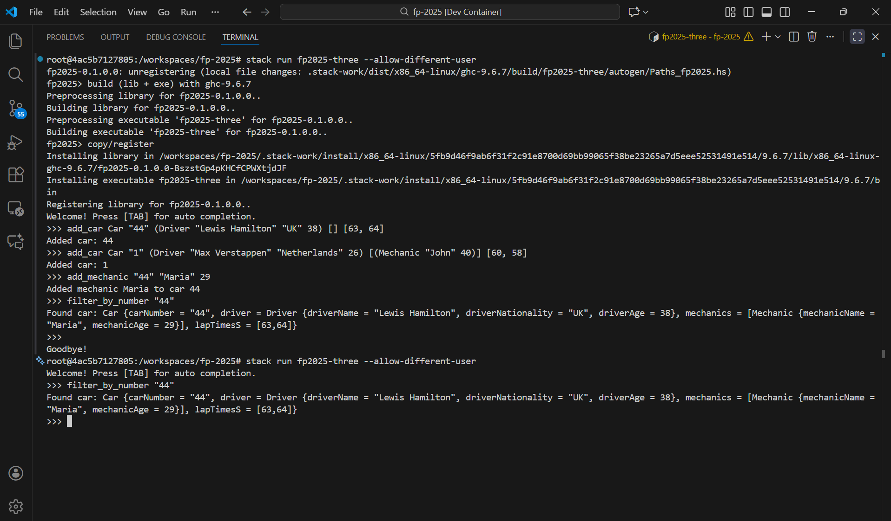
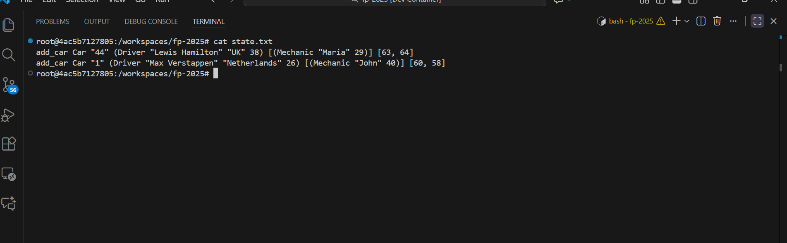

# fp-2025

## Lesson notes

Can be viewed [here](https://vipo.github.io/fp-2025/)

## Setup

### To get started, you first need to open the project using Visual Studio Code and having Docker Desktop
1. `Ctrl + Shift + P`
2. `Dev Containers: Open Folder in Container`

### To Build & Test the Project, run the following commands
1. `stack build`
2. `stack test`

#BNF
```
<command> ::= "AddCar" <car>
            | "FilterByNumber" <carNumber>
            | "AddMechanic" <carNumber> <mechanicName> <mechanicAge>
            | "Sequence" <command> <command>
            | "CalculateAverageLapTime" <car>
            | "Dump" <dumpable>

<car> ::= "Car" <carNumber> <driver> <mechanics> <lapTimes>

<driver> ::= "Driver" <driverName> <driverNationality> <driverAge>

<mechanics> ::= "[" <mechanicList> "]"

<mechanicList> ::= <mechanic> | <mechanic> "," <mechanicList>

<mechanic> ::= "Mechanic" <mechanicName> <mechanicAge>

<lapTimes> ::= "[" <intList> "]"

<intList> ::= <integer> 
            | <integer> "," <intList>

<carNumber> ::= <string>
<driverName> ::= <string>
<driverNationality> ::= <string>
<mechanicName> ::= <string>
<mechanicAge> ::= <integer>
<driverAge> ::= <integer>

<dumpable> ::= "Examples"

<string> ::= "[a-zA-Z0-9_]+"
<integer> ::= "[0-9]+"
```

# Formula 1 Racing Management System

## State Persistence

### Overview

The state persistence system converts the in-memory application state into a sequence of CLI commands that can be saved to a file and replayed to restore the exact same state. This approach ensures that the state file remains human-readable and compatible with the command-line interface.

### State Structure

The `State` data type contains:
```haskell
data State = State {
    stateCars :: [Lib1.Car]
}
```

Each `Car` contains:
- `carNumber` - The car's racing number
- `driver` - Driver information (name, nationality, age)
- `mechanics` - List of mechanics assigned to the car
- `lapTimesS` - List of lap times in seconds

### Mapping Strategy

#### State Fields to Commands

1. **Cars List (`stateCars`)**: 
   - Each car in the state is mapped to a single `add_car` command
   - All car properties (driver, mechanics, lap times) are included in the command
   
2. **Commands Not Persisted**:
   - `filter_by_number` - Query command, doesn't modify state
   - `calculate_average_lap_time` - Calculation command, doesn't modify state
   - `dump_examples` - Display command, doesn't modify state
   - `add_mechanic` - When a mechanic is added to a car, it modifies the car's mechanics list, so the entire car (with updated mechanics) is saved in the next state persistence

### Examples

#### Example 1: Simple State with Two Cars

**State:**
```haskell
State {
    stateCars = [
        Car {
            carNumber = "44",
            driver = Driver "Lewis Hamilton" "UK" 38,
            mechanics = [],
            lapTimesS = [63, 64]
        },
        Car {
            carNumber = "1",
            driver = Driver "Max Verstappen" "Netherlands" 26,
            mechanics = [Mechanic "John" 40],
            lapTimesS = [60, 58]
        }
    ]
}
```

**Generated CLI Commands (state.txt):**
```
add_car Car "44" (Driver "Lewis Hamilton" "UK" 38) [] [63, 64]
add_car Car "1" (Driver "Max Verstappen" "Netherlands" 26) [(Mechanic "John" 40)] [60, 58]
```

#### Example 2: Complex State with Multiple Mechanics

**State:**
```haskell
State {
    stateCars = [
        Car {
            carNumber = "16",
            driver = Driver "Charles Leclerc" "Monaco" 25,
            mechanics = [
                Mechanic "Luca" 33,
                Mechanic "Sofia" 28
            ],
            lapTimesS = [59, 59, 61]
        },
        Car {
            carNumber = "63",
            driver = Driver "George Russell" "UK" 26,
            mechanics = [
                Mechanic "Peter" 45,
                Mechanic "Anna" 31,
                Mechanic "Mark" 29
            ],
            lapTimesS = [62, 61, 60, 63]
        }
    ]
}
```

**Generated CLI Commands (state.txt):**
```
add_car Car "16" (Driver "Charles Leclerc" "Monaco" 25) [(Mechanic "Luca" 33), (Mechanic "Sofia" 28)] [59, 59, 61]
add_car Car "63" (Driver "George Russell" "UK" 26) [(Mechanic "Peter" 45), (Mechanic "Anna" 31), (Mechanic "Mark" 29)] [62, 61, 60, 63]
```

### Persistence Demonstration

#### Screenshot Guide

The following screenshots demonstrate the state persistence workflow:

**Step 1: Initial Program Launch and Command Execution**
```
$ stack run fp2025-three
> add_car Car "44" (Driver "Lewis Hamilton" "UK" 38) [] [63, 64]
Added car: 44
> add_car Car "1" (Driver "Max Verstappen" "Netherlands" 26) [(Mechanic "John" 40)] [60, 58]
Added car: 1
> filter_by_number "44"
Found car: Car {carNumber = "44", driver = Driver {driverName = "Lewis Hamilton", ...}, ...}
```


**Step 3: View State File**
```
$ cat state.txt
add_car Car "44" (Driver "Lewis Hamilton" "UK" 38) [] [63, 64]
add_car Car "1" (Driver "Max Verstappen" "Netherlands" 26) [(Mechanic "John" 40)] [60, 58]
```


## Usage Examples

### Adding Cars and Mechanics

```bash
# Add a car with no mechanics
add_car Car "44" (Driver "Lewis Hamilton" "UK" 38) [] [63, 64]

# Add a car with mechanics
add_car Car "1" (Driver "Max Verstappen" "Netherlands" 26) [(Mechanic "John" 40)] [60, 58]

# Add a mechanic to an existing car (modifies the car in state)
add_mechanic "44" "Maria" 29
```

### Querying State

```bash
filter_by_number "44"

calculate_average_lap_time Car "44" (Driver "Lewis Hamilton" "UK" 38) [] [63, 64, 62]
```

### Command Sequences

```bash
# Execute multiple commands in one line
add_car Car "16" (Driver "Charles Leclerc" "Monaco" 25) [] [61]; filter_by_number "16"
```